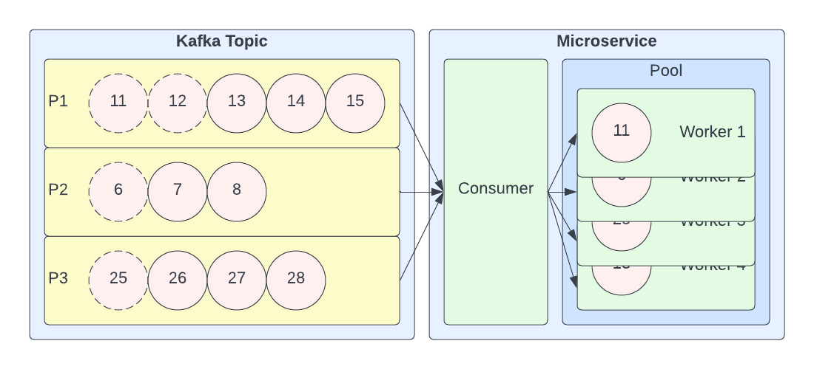

# Dynamic Subpartition Router



Context: given a partitioned message stream (such as an Apache Kafka topic) and an 
arbitrarily-sized processing pool; we need to distribute messages such that there's only 1 
thread per message key and that threads are maximally utilized.

## Solution

1. We have a single consumer thread
2. This consumer routes messages using the algorithm:
    1. Submit a message to a worker processing the same key and mark the message as read
    2. If none exists, submit the message to a vacant worker and mark the message as read
    3. If none exists, try again later

## Requirements

* Java 11
* Maven

## Running

```shell
mvn quarkus:dev
```

### Example Output

```
$ mvn quarkus:dev
[INFO] Scanning for projects...
[INFO]
[INFO] ---------< io.github.chadhartman:dynamic-subpartition-router >----------
[INFO] Building dynamic-subpartition-router 1.0.0-SNAPSHOT
[INFO] --------------------------------[ jar ]---------------------------------
[INFO]
[INFO] --- quarkus-maven-plugin:2.15.3.Final:dev (default-cli) @ dynamic-subpartition-router ---
[INFO] Invoking org.apache.maven.plugins:maven-resources-plugin:2.6:resources @ dynamic-subpartition-router
[INFO] Using 'UTF-8' encoding to copy filtered resources.
[INFO] Copying 1 resource
[INFO] Invoking io.quarkus.platform:quarkus-maven-plugin:2.15.3.Final:generate-code @ dynamic-subpartition-router
[INFO] Invoking org.apache.maven.plugins:maven-compiler-plugin:3.10.1:compile @ dynamic-subpartition-router
[INFO] Nothing to compile - all classes are up to date
[INFO] Invoking org.apache.maven.plugins:maven-resources-plugin:2.6:testResources @ dynamic-subpartition-router
[INFO] Using 'UTF-8' encoding to copy filtered resources.
[INFO] skip non existing resourceDirectory /Users/chadhartman/Documents/repos/chadhartman/dynamic-subpartition-router/src/test/resources
[INFO] Invoking io.quarkus.platform:quarkus-maven-plugin:2.15.3.Final:generate-code-tests @ dynamic-subpartition-router
[INFO] Invoking org.apache.maven.plugins:maven-compiler-plugin:3.10.1:testCompile @ dynamic-subpartition-router
[INFO] No sources to compile
Listening for transport dt_socket at address: 5005

__  ____  __  _____   ___  __ ____  ______
 --/ __ \/ / / / _ | / _ \/ //_/ / / / __/
 -/ /_/ / /_/ / __ |/ , _/ ,< / /_/ /\ \
--\___\_\____/_/ |_/_/|_/_/|_|\____/___/
INFO  [io.quarkus] dynamic-subpartition-router 1.0.0-SNAPSHOT on JVM (powered by Quarkus 2.15.3.Final) started in 0.975s.

INFO  [io.quarkus] Profile dev activated. Live Coding activated.
INFO  [io.quarkus] Installed features: [cdi]
DEBUG [io.git.cha.dyn.sub.rou.Worker] [worker_1] Submitted "delta"
DEBUG [io.git.cha.dyn.sub.rou.Worker] [worker_2] Submitted "eta"
DEBUG [io.git.cha.dyn.sub.rou.Worker] [worker_3] Submitted "iota"
DEBUG [io.git.cha.dyn.sub.rou.Worker] [worker_4] Submitted "gamma"
DEBUG [io.git.cha.dyn.sub.rou.Worker] [worker_2] Submitted "eta"
DEBUG [io.git.cha.dyn.sub.rou.Worker] [worker_1] Submitted "delta"
DEBUG [io.git.cha.dyn.sub.rou.Worker] [worker_5] Submitted "beta"
DEBUG [io.git.cha.dyn.sub.rou.Worker] [worker_3] Submitted "iota"
DEBUG [io.git.cha.dyn.sub.rou.Worker] [worker_4] Submitted "gamma"
DEBUG [io.git.cha.dyn.sub.rou.Worker] [worker_2] Submitted "eta"
DEBUG [io.git.cha.dyn.sub.rou.Worker] [worker_4] Completed "gamma"
DEBUG [io.git.cha.dyn.sub.rou.Worker] [worker_2] Completed "eta"
DEBUG [io.git.cha.dyn.sub.rou.Worker] [worker_3] Completed "iota"
DEBUG [io.git.cha.dyn.sub.rou.Worker] [worker_2] Completed "eta"
DEBUG [io.git.cha.dyn.sub.rou.Worker] [worker_5] Completed "beta"
DEBUG [io.git.cha.dyn.sub.rou.Worker] [worker_5] Submitted "epsilon"
DEBUG [io.git.cha.dyn.sub.rou.Worker] [worker_3] Submitted "iota"
DEBUG [io.git.cha.dyn.sub.rou.Worker] [worker_4] Submitted "gamma"
DEBUG [io.git.cha.dyn.sub.rou.Worker] [worker_5] Completed "epsilon"
DEBUG [io.git.cha.dyn.sub.rou.Worker] [worker_5] Submitted "theta"
DEBUG [io.git.cha.dyn.sub.rou.Worker] [worker_1] Completed "delta"
DEBUG [io.git.cha.dyn.sub.rou.Worker] [worker_4] Completed "gamma"
DEBUG [io.git.cha.dyn.sub.rou.Worker] [worker_2] Completed "eta"
DEBUG [io.git.cha.dyn.sub.rou.Worker] [worker_2] Submitted "epsilon"
DEBUG [io.git.cha.dyn.sub.rou.Worker] [worker_3] Submitted "iota"
DEBUG [io.git.cha.dyn.sub.rou.Worker] [worker_5] Submitted "theta"
DEBUG [io.git.cha.dyn.sub.rou.Worker] [worker_3] Completed "iota"
DEBUG [io.git.cha.dyn.sub.rou.Worker] [worker_2] Completed "epsilon"
DEBUG [io.git.cha.dyn.sub.rou.Worker] [worker_2] Submitted "alpha"
DEBUG [io.git.cha.dyn.sub.rou.Worker] [worker_5] Completed "theta"
DEBUG [io.git.cha.dyn.sub.rou.Worker] [worker_5] Completed "theta"
DEBUG [io.git.cha.dyn.sub.rou.Worker] [worker_5] Submitted "eta"
DEBUG [io.git.cha.dyn.sub.rou.Worker] [worker_1] Completed "delta"
DEBUG [io.git.cha.dyn.sub.rou.Worker] [worker_1] Submitted "theta"
DEBUG [io.git.cha.dyn.sub.rou.Worker] [worker_4] Submitted "gamma"
DEBUG [io.git.cha.dyn.sub.rou.Worker] [worker_4] Submitted "gamma"
DEBUG [io.git.cha.dyn.sub.rou.Worker] [worker_3] Submitted "iota"
DEBUG [io.git.cha.dyn.sub.rou.Worker] [worker_2] Completed "alpha"
DEBUG [io.git.cha.dyn.sub.rou.Worker] [worker_2] Submitted "beta"
DEBUG [io.git.cha.dyn.sub.rou.Worker] [worker_5] Completed "eta"
DEBUG [io.git.cha.dyn.sub.rou.Worker] [worker_5] Submitted "alpha"
DEBUG [io.git.cha.dyn.sub.rou.Worker] [worker_4] Submitted "gamma"
DEBUG [io.git.cha.dyn.sub.rou.Worker] [worker_3] Completed "iota"
DEBUG [io.git.cha.dyn.sub.rou.Worker] [worker_4] Completed "gamma"
DEBUG [io.git.cha.dyn.sub.rou.Worker] [worker_5] Completed "alpha"
DEBUG [io.git.cha.dyn.sub.rou.Worker] [worker_5] Submitted "epsilon"
DEBUG [io.git.cha.dyn.sub.rou.Worker] [worker_3] Completed "iota"
DEBUG [io.git.cha.dyn.sub.rou.Worker] [worker_1] Completed "theta"
DEBUG [io.git.cha.dyn.sub.rou.Worker] [worker_1] Submitted "eta"
DEBUG [io.git.cha.dyn.sub.rou.Worker] [worker_3] Submitted "iota"
DEBUG [io.git.cha.dyn.sub.rou.Worker] [worker_5] Completed "epsilon"
DEBUG [io.git.cha.dyn.sub.rou.Worker] [worker_5] Submitted "alpha"
DEBUG [io.git.cha.dyn.sub.rou.Worker] [worker_5] Completed "alpha"
DEBUG [io.git.cha.dyn.sub.rou.Worker] [worker_5] Submitted "epsilon"
DEBUG [io.git.cha.dyn.sub.rou.Worker] [worker_1] Submitted "eta"
DEBUG [io.git.cha.dyn.sub.rou.Worker] [worker_2] Completed "beta"
DEBUG [io.git.cha.dyn.sub.rou.Worker] [worker_2] Submitted "delta"
DEBUG [io.git.cha.dyn.sub.rou.Worker] [worker_3] Submitted "iota"
DEBUG [io.git.cha.dyn.sub.rou.Worker] [worker_3] Submitted "iota"
DEBUG [io.git.cha.dyn.sub.rou.Worker] [worker_4] Completed "gamma"
DEBUG [io.git.cha.dyn.sub.rou.Worker] [worker_1] Completed "eta"
DEBUG [io.git.cha.dyn.sub.rou.Worker] [worker_3] Completed "iota"
DEBUG [io.git.cha.dyn.sub.rou.Worker] [worker_4] Completed "gamma"
DEBUG [io.git.cha.dyn.sub.rou.Worker] [worker_2] Completed "delta"
DEBUG [io.git.cha.dyn.sub.rou.Worker] [worker_2] Submitted "beta"
DEBUG [io.git.cha.dyn.sub.rou.Worker] [worker_1] Submitted "eta"
DEBUG [io.git.cha.dyn.sub.rou.Worker] [worker_1] Submitted "eta"
DEBUG [io.git.cha.dyn.sub.rou.Worker] [worker_2] Completed "beta"
DEBUG [io.git.cha.dyn.sub.rou.Worker] [worker_2] Submitted "alpha"
DEBUG [io.git.cha.dyn.sub.rou.Worker] [worker_1] Completed "eta"
DEBUG [io.git.cha.dyn.sub.rou.Worker] [worker_5] Completed "epsilon"
DEBUG [io.git.cha.dyn.sub.rou.Worker] [worker_5] Submitted "delta"
DEBUG [io.git.cha.dyn.sub.rou.Worker] [worker_1] Submitted "eta"
DEBUG [io.git.cha.dyn.sub.rou.Worker] [worker_3] Completed "iota"
DEBUG [io.git.cha.dyn.sub.rou.Worker] [worker_4] Completed "gamma"
DEBUG [io.git.cha.dyn.sub.rou.Worker] [worker_4] Submitted "epsilon"
DEBUG [io.git.cha.dyn.sub.rou.Worker] [worker_3] Completed "iota"
DEBUG [io.git.cha.dyn.sub.rou.Worker] [worker_4] Completed "epsilon"
DEBUG [io.git.cha.dyn.sub.rou.Worker] [worker_4] Submitted "gamma"
DEBUG [io.git.cha.dyn.sub.rou.Worker] [worker_2] Submitted "alpha"
DEBUG [io.git.cha.dyn.sub.rou.Worker] [worker_4] Submitted "gamma"
DEBUG [io.git.cha.dyn.sub.rou.Worker] [worker_3] Submitted "iota"
DEBUG [io.git.cha.dyn.sub.rou.Worker] [worker_3] Submitted "iota"
DEBUG [io.git.cha.dyn.sub.rou.Worker] [worker_1] Submitted "eta"
DEBUG [io.git.cha.dyn.sub.rou.Worker] [worker_1] Submitted "eta"
DEBUG [io.git.cha.dyn.sub.rou.Worker] [worker_2] Completed "alpha"
DEBUG [io.git.cha.dyn.sub.rou.Worker] [worker_5] Completed "delta"
DEBUG [io.git.cha.dyn.sub.rou.Worker] [worker_5] Submitted "epsilon"
DEBUG [io.git.cha.dyn.sub.rou.Worker] [worker_4] Submitted "gamma"
DEBUG [io.git.cha.dyn.sub.rou.Worker] [worker_4] Submitted "gamma"
DEBUG [io.git.cha.dyn.sub.rou.Worker] [worker_3] Submitted "iota"
DEBUG [io.git.cha.dyn.sub.rou.Worker] [worker_1] Completed "eta"
DEBUG [io.git.cha.dyn.sub.rou.Worker] [worker_5] Completed "epsilon"
DEBUG [io.git.cha.dyn.sub.rou.Worker] [worker_5] Submitted "beta"
DEBUG [io.git.cha.dyn.sub.rou.Worker] [worker_5] Submitted "beta"
DEBUG [io.git.cha.dyn.sub.rou.Worker] [worker_1] Submitted "eta"
DEBUG [io.git.cha.dyn.sub.rou.Worker] [worker_2] Completed "alpha"
DEBUG [io.git.cha.dyn.sub.rou.Worker] [worker_2] Submitted "theta"
DEBUG [io.git.cha.dyn.sub.rou.Worker] [worker_5] Submitted "beta"
DEBUG [io.git.cha.dyn.sub.rou.Worker] [worker_3] Submitted "iota"
DEBUG [io.git.cha.dyn.sub.rou.Worker] [worker_1] Submitted "eta"
DEBUG [io.git.cha.dyn.sub.rou.Worker] [worker_4] Completed "gamma"
DEBUG [io.git.cha.dyn.sub.rou.Worker] [worker_2] Completed "theta"
DEBUG [io.git.cha.dyn.sub.rou.Worker] [worker_2] Submitted "delta"
DEBUG [io.git.cha.dyn.sub.rou.Worker] [worker_3] Completed "iota"
DEBUG [io.git.cha.dyn.sub.rou.Worker] [worker_2] Completed "delta"
DEBUG [io.git.cha.dyn.sub.rou.Worker] [worker_2] Submitted "theta"
DEBUG [io.git.cha.dyn.sub.rou.Worker] [worker_4] Submitted "gamma"
DEBUG [io.git.cha.dyn.sub.rou.Worker] [worker_1] Submitted "eta"
DEBUG [io.git.cha.dyn.sub.rou.Worker] [worker_1] Submitted "eta"
DEBUG [io.git.cha.dyn.sub.rou.Worker] [worker_1] Submitted "eta"
DEBUG [io.git.cha.dyn.sub.rou.Worker] [worker_4] Submitted "gamma"
DEBUG [io.git.cha.dyn.sub.rou.Worker] [worker_3] Completed "iota"
DEBUG [io.git.cha.dyn.sub.rou.Worker] [worker_1] Completed "eta"
DEBUG [io.git.cha.dyn.sub.rou.Worker] [worker_2] Completed "theta"
DEBUG [io.git.cha.dyn.sub.rou.Worker] [worker_2] Submitted "alpha"
DEBUG [io.git.cha.dyn.sub.rou.Worker] [worker_5] Submitted "beta"
DEBUG [io.git.cha.dyn.sub.rou.Worker] [worker_1] Submitted "eta"
DEBUG [io.git.cha.dyn.sub.rou.Worker] [worker_5] Completed "beta"
DEBUG [io.git.cha.dyn.sub.rou.Worker] [worker_3] Completed "iota"
DEBUG [io.git.cha.dyn.sub.rou.Worker] [worker_4] Completed "gamma"
DEBUG [io.git.cha.dyn.sub.rou.Worker] [worker_1] Completed "eta"
DEBUG [io.git.cha.dyn.sub.rou.Worker] [worker_3] Completed "iota"
DEBUG [io.git.cha.dyn.sub.rou.Worker] [worker_2] Completed "alpha"
DEBUG [io.git.cha.dyn.sub.rou.Worker] [worker_2] Submitted "epsilon"
DEBUG [io.git.cha.dyn.sub.rou.Worker] [worker_1] Submitted "eta"
DEBUG [io.git.cha.dyn.sub.rou.Worker] [worker_4] Submitted "gamma"
DEBUG [io.git.cha.dyn.sub.rou.Worker] [worker_3] Submitted "iota"
DEBUG [io.git.cha.dyn.sub.rou.Worker] [worker_4] Completed "gamma"
DEBUG [io.git.cha.dyn.sub.rou.Worker] [worker_5] Completed "beta"
DEBUG [io.git.cha.dyn.sub.rou.Worker] [worker_2] Completed "epsilon"
DEBUG [io.git.cha.dyn.sub.rou.Worker] [worker_2] Submitted "alpha"
DEBUG [io.git.cha.dyn.sub.rou.Worker] [worker_4] Submitted "gamma"
DEBUG [io.git.cha.dyn.sub.rou.Worker] [worker_1] Completed "eta"
DEBUG [io.git.cha.dyn.sub.rou.Worker] [worker_3] Completed "iota"
DEBUG [io.git.cha.dyn.sub.rou.Worker] [worker_5] Completed "beta"
DEBUG [io.git.cha.dyn.sub.rou.Worker] [worker_4] Completed "gamma"
DEBUG [io.git.cha.dyn.sub.rou.Worker] [worker_2] Completed "alpha"
DEBUG [io.git.cha.dyn.sub.rou.Worker] [worker_2] Submitted "theta"
DEBUG [io.git.cha.dyn.sub.rou.Worker] [worker_4] Submitted "gamma"
DEBUG [io.git.cha.dyn.sub.rou.Worker] [worker_3] Completed "iota"
DEBUG [io.git.cha.dyn.sub.rou.Worker] [worker_3] Submitted "epsilon"
DEBUG [io.git.cha.dyn.sub.rou.Worker] [worker_3] Completed "epsilon"
DEBUG [io.git.cha.dyn.sub.rou.Worker] [worker_3] Submitted "delta"
DEBUG [io.git.cha.dyn.sub.rou.Worker] [worker_1] Submitted "eta"
DEBUG [io.git.cha.dyn.sub.rou.Worker] [worker_1] Submitted "eta"
DEBUG [io.git.cha.dyn.sub.rou.Worker] [worker_1] Completed "eta"
DEBUG [io.git.cha.dyn.sub.rou.Worker] [worker_5] Completed "beta"
DEBUG [io.git.cha.dyn.sub.rou.Worker] [worker_5] Submitted "epsilon"
DEBUG [io.git.cha.dyn.sub.rou.Worker] [worker_3] Completed "delta"
DEBUG [io.git.cha.dyn.sub.rou.Worker] [worker_3] Submitted "alpha"
DEBUG [io.git.cha.dyn.sub.rou.Worker] [worker_3] Submitted "alpha"
DEBUG [io.git.cha.dyn.sub.rou.Worker] [worker_5] Submitted "epsilon"
DEBUG [io.git.cha.dyn.sub.rou.Worker] [worker_1] Submitted "eta"
DEBUG [io.git.cha.dyn.sub.rou.Worker] [worker_4] Completed "gamma"
DEBUG [io.git.cha.dyn.sub.rou.Worker] [worker_2] Completed "theta"
DEBUG [io.git.cha.dyn.sub.rou.Worker] [worker_2] Submitted "delta"
DEBUG [io.git.cha.dyn.sub.rou.Worker] [worker_5] Completed "epsilon"
DEBUG [io.git.cha.dyn.sub.rou.Worker] [worker_2] Completed "delta"
DEBUG [io.git.cha.dyn.sub.rou.Worker] [worker_2] Submitted "beta"
DEBUG [io.git.cha.dyn.sub.rou.Worker] [worker_3] Submitted "alpha"
DEBUG [io.git.cha.dyn.sub.rou.Worker] [worker_5] Submitted "epsilon"
DEBUG [io.git.cha.dyn.sub.rou.Worker] [worker_2] Submitted "beta"
DEBUG [io.git.cha.dyn.sub.rou.Worker] [worker_2] Submitted "beta"
DEBUG [io.git.cha.dyn.sub.rou.Worker] [worker_1] Submitted "eta"
DEBUG [io.git.cha.dyn.sub.rou.Worker] [worker_4] Submitted "gamma"
DEBUG [io.git.cha.dyn.sub.rou.Worker] [worker_4] Submitted "gamma"
DEBUG [io.git.cha.dyn.sub.rou.Worker] [worker_4] Submitted "gamma"
DEBUG [io.git.cha.dyn.sub.rou.Worker] [worker_1] Submitted "eta"
DEBUG [io.git.cha.dyn.sub.rou.Worker] [worker_3] Completed "alpha"
DEBUG [io.git.cha.dyn.sub.rou.Worker] [worker_2] Completed "beta"
DEBUG [io.git.cha.dyn.sub.rou.Worker] [worker_1] Completed "eta"
DEBUG [io.git.cha.dyn.sub.rou.Worker] [worker_5] Completed "epsilon"
DEBUG [io.git.cha.dyn.sub.rou.Worker] [worker_4] Completed "gamma"
DEBUG [io.git.cha.dyn.sub.rou.Worker] [worker_3] Completed "alpha"
DEBUG [io.git.cha.dyn.sub.rou.Worker] [worker_2] Completed "beta"
DEBUG [io.git.cha.dyn.sub.rou.Worker] [worker_5] Completed "epsilon"
DEBUG [io.git.cha.dyn.sub.rou.Worker] [worker_5] Submitted "delta"
DEBUG [io.git.cha.dyn.sub.rou.Worker] [worker_2] Submitted "beta"
DEBUG [io.git.cha.dyn.sub.rou.Worker] [worker_2] Completed "beta"
DEBUG [io.git.cha.dyn.sub.rou.Worker] [worker_3] Completed "alpha"
DEBUG [io.git.cha.dyn.sub.rou.Worker] [worker_5] Completed "delta"
DEBUG [io.git.cha.dyn.sub.rou.Worker] [worker_1] Completed "eta"
DEBUG [io.git.cha.dyn.sub.rou.Worker] [worker_4] Completed "gamma"
DEBUG [io.git.cha.dyn.sub.rou.Worker] [worker_1] Completed "eta"
DEBUG [io.git.cha.dyn.sub.rou.Worker] [worker_1] Completed "eta"
DEBUG [io.git.cha.dyn.sub.rou.Worker] [worker_2] Completed "beta"
DEBUG [io.git.cha.dyn.sub.rou.Worker] [worker_4] Completed "gamma"
DEBUG [io.git.cha.dyn.sub.rou.Worker] [worker_1] Completed "eta"
DEBUG [io.git.cha.dyn.sub.rou.Worker] [worker_1] Completed "eta"
DEBUG [io.git.cha.dyn.sub.rou.Worker] [worker_4] Completed "gamma"
DEBUG [io.git.cha.dyn.sub.rou.Worker] [worker_1] Completed "eta"
DEBUG [io.git.cha.dyn.sub.rou.Worker] [worker_1] Completed "eta"
DEBUG [io.git.cha.dyn.sub.rou.Worker] [worker_4] Completed "gamma"
DEBUG [io.git.cha.dyn.sub.rou.Worker] [worker_1] Completed "eta"
DEBUG [io.git.cha.dyn.sub.rou.Worker] [worker_4] Completed "gamma"
DEBUG [io.git.cha.dyn.sub.rou.Worker] [worker_4] Completed "gamma"
DEBUG [io.git.cha.dyn.sub.rou.Worker] [worker_1] Completed "eta"
DEBUG [io.git.cha.dyn.sub.rou.Worker] [worker_1] Completed "eta"
DEBUG [io.git.cha.dyn.sub.rou.Worker] [worker_1] Completed "eta"
INFO  [io.quarkus] dynamic-subpartition-router stopped in 4.168s
```
